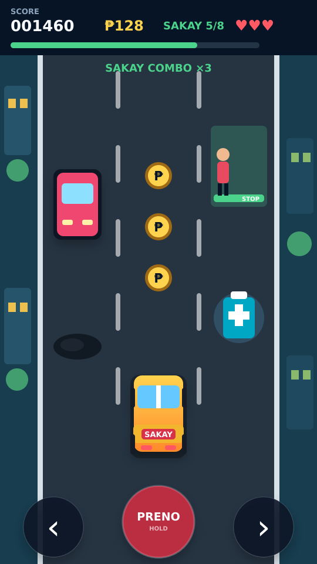

# Jeepney Dash: Byaheng Pinoy

A mobile-first 2D Filipino endless-driving game prototype. Drive a colorful jeepney through three traffic lanes, collect coins and fuel, stop for passengers, and avoid road hazards.



This package contains two implementations:

- `godot/` — the main Godot 4 project intended for Android export.
- `web-preview/` — a dependency-free browser/PWA preview with the same core gameplay, ready to test on a phone.

## Included gameplay

- Three-lane driving with swipe, touch-button, or keyboard controls
- Passenger stops that require braking
- Coins, fuel pickups, fares, combos, and high scores
- Cars, tricycles, cones, and potholes
- Fuel and three-heart damage systems
- Increasing difficulty, pause, restart, sound effects, and local high-score saving
- Portrait 9:16 responsive layout

## Try the web preview

For the most reliable local preview, serve the folder through a local web server:

```bash
cd web-preview
python -m http.server 8080
```

Open `http://localhost:8080` in a browser. On a phone connected to the same Wi-Fi, replace `localhost` with your computer's local IP address.

Controls:

- Swipe left/right or tap the arrow buttons to change lanes.
- Hold **PRENO** while passing a passenger stop.
- Keyboard: `A`/`D` or arrow keys to steer, `Space` to brake, `P` to pause.

## Open the Godot project

1. Install Godot 4.x.
2. Open Godot Project Manager.
3. Choose **Import**, then select `godot/project.godot`.
4. Press **F6/F5** to run.

The Godot project uses procedural vector-style drawing, so it does not require external art assets.

## Validate the project

With Node.js installed, run:

```bash
npm test
npm run check
```

The test suite checks the scoring and pickup rules, mobile UI initialization, pause/resume behavior, project structure, and JavaScript syntax.

## Export to Android

1. In Godot, install the Android build template and configure the Android SDK/JDK under **Editor Settings > Export > Android**.
2. Open **Project > Export** and choose the included Android preset.
3. Set a unique package name and signing keystore for a release build.
4. Export an APK for direct testing or an AAB for Google Play.

For a production release, replace the placeholder package ID, add final icons/screenshots, test on several screen sizes, and create your own signing key. Never commit the release keystore or its password.

## Project structure

```text
jeepney-dash/
├── docs/                 Game design and roadmap
├── godot/                Godot 4 Android-ready source
│   ├── main.tscn
│   ├── project.godot
│   └── scripts/main.gd
├── tests/                Dependency-free JavaScript tests
└── web-preview/          Installable mobile web preview
```

## Recommended next milestones

1. Replace procedural drawings with original sprites and animations.
2. Add route selection, missions, and a jeepney garage.
3. Add background music and properly licensed Filipino-inspired audio.
4. Add Google Play Games leaderboards only after the offline loop feels polished.
5. Test performance and controls on low-end Android devices.
